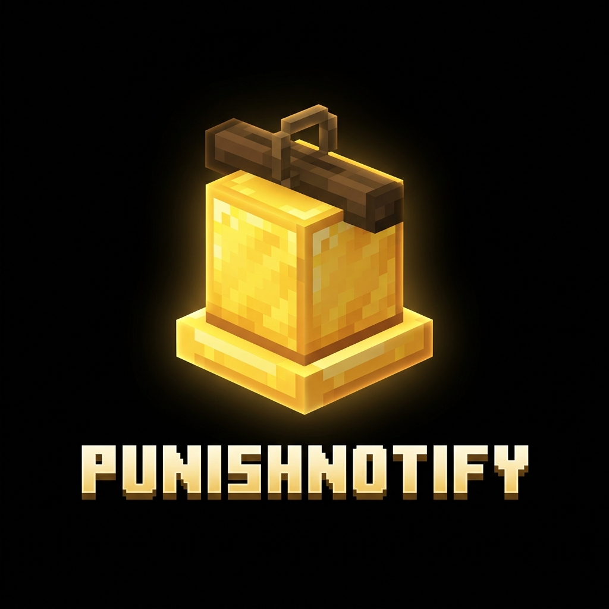
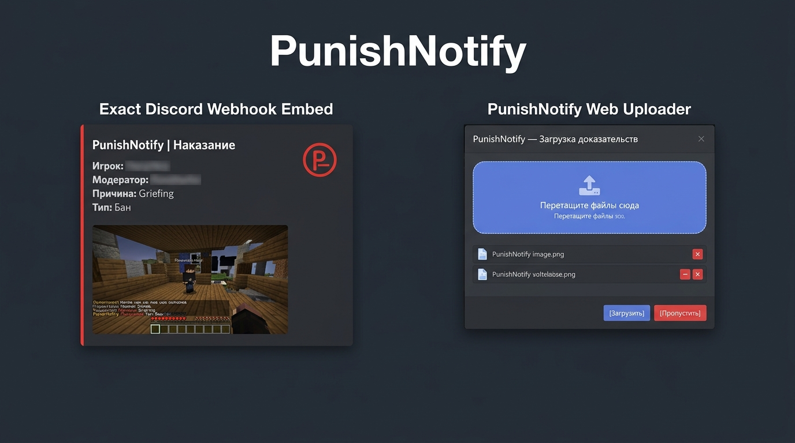

<p align="center">
  
</p>

# PunishNotify

> 🛠️ **Discord Punishment Notification Plugin with Web Evidence Attachment for Paper 1.21.11**

<p align="center">
  
</p>

[English Description](#-english) | [Русское описание](#-русский)

---

<a name="-english"></a>
## 🌐 English

**PunishNotify** is a powerful, lightweight Minecraft Paper 1.21.11 plugin designed to seamlessly bridge server moderation (via EssentialsX) with your Discord moderation channels.

When a moderator bans, mutes, kicks, warns, or jails a player, **PunishNotify** intercepts the action and initiates a high-speed Discord notification process. What sets PunishNotify apart is its **interactive web-based evidence submission system**: moderators receive an in-game prompt with action buttons allowing them to drag-and-drop screenshots or videos directly via a browser interface before the notification is posted to Discord.

---

### ✨ Key Features

- 📢 **Comprehensive Punishment Tracking**: Automatically detects `ban`, `tempban`, `unban` (pardon), `mute`, `unmute`, `kick`, `warn`, `jail`, and `unjail` events.
- 🖼️ **Web Evidence Uploader**:
  - Generates a secure, temporary web upload link sent directly to the moderator in Minecraft chat.
  - Interactive Drag & Drop web interface built with modern UI.
  - Supports multiple image and video formats (up to configurable file size & count limits).
  - Automatically embeds the primary image into the Discord embed while attaching remaining files as message attachments.
  - Files are automatically deleted from server storage once dispatched.
- ⏳ **Smart Timeout & Skip Logic**:
  - Moderators can click **[Skip]** in chat or on the web page to instantly send the webhook without evidence.
  - Configurable timeout (default: 2 minutes) automatically dispatches the webhook without attachments if no files are uploaded in time.
- 🔄 **Fault-Tolerant Retry Queue**:
  - Outages or Discord API rate limits will not cause lost reports.
  - Failed dispatches enter an in-memory retry queue with configurable attempt counts and backoff intervals.
- ⚙️ **Granular Event Toggles**: Individually enable or disable webhook notifications for specific punishment types in `config.yml`.

---

### 🔄 How It Works

```
 1. Moderator executes punishment command (/ban, /mute, /warn, etc.)
                          │
                          ▼
 2. PunishNotify intercepts event & generates a unique upload token
                          │
                          ▼
 3. In-Game Prompt sent to Moderator: [Upload Evidence] [Skip]
                          │
          ┌───────────────┴───────────────┐
          ▼                               ▼
 [Moderator Uploads File]         [Skip or Timeout (120s)]
          │                               │
          ▼                               ▼
 Embed created with images       Embed created without attachments
          │                               │
          └───────────────┬───────────────┘
                          ▼
 4. Dispatch to Discord Webhook (with retry queue if API fails)
```

---

### 📜 Commands & Permissions

| Command | Permission | Default | Description |
| :--- | :--- | :---: | :--- |
| `/punishnotify reload` | `punishnotify.reload` | `op` | Reloads plugin configuration (`config.yml`). |
| `/punishnotify skip <token>` | `punishnotify.skip` | `op` | Skips evidence uploading for an active punishment token. |
| *(Admin Super-node)* | `punishnotify.admin` | `op` | Grants full access to all plugin commands and permissions. |

---

### ⚙️ Configuration Guide (`config.yml`)

The configuration file is located at `plugins/PunishNotify/config.yml`.

| Path | Type | Default | Description |
| :--- | :---: | :---: | :--- |
| **`language`** | `String` | `"en"` | Plugin language code. Built-in: `en`, `ru`. Custom locales can be added in `plugins/PunishNotify/lang/`. |
| **`discord.webhook-url`** | `String` | `""` | The Discord Webhook URL. Webhooks are disabled if empty. |
| **`discord.username`** | `String` | `"PunishNotify"` | Custom bot display name in Discord. |
| **`discord.avatar-url`** | `String` | `""` | Direct image URL for the Discord webhook avatar. |
| **`discord.retry-enabled`** | `Boolean` | `true` | Enables the automatic retry queue for failed webhook transmissions. |
| **`discord.retry-max-attempts`** | `Integer` | `5` | Maximum delivery attempts before dropping a report. |
| **`discord.retry-interval-seconds`** | `Integer` | `30` | Time interval (seconds) between retry attempts. |
| **`http-server.enabled`** | `Boolean` | `true` | Enables the built-in HTTP server for evidence uploading. |
| **`http-server.port`** | `Integer` | `8734` | Network port for the HTTP upload server. |
| **`http-server.bind`** | `String` | `"0.0.0.0"` | Network interface IP binding (`0.0.0.0` listens on all interfaces). |
| **`http-server.public-url`** | `String` | `""` | Public external URL displayed to moderators (e.g. `http://server.example.com:8734`). If empty, defaults to `http://<bind>:<port>`. |
| **`evidence.max-file-size-mb`** | `Integer` | `25` | Maximum allowed size (in MB) per uploaded file. |
| **`evidence.max-files`** | `Integer` | `10` | Maximum number of files permitted per punishment report. |
| **`evidence.timeout-seconds`** | `Integer` | `120` | Waiting period (seconds) before auto-sending report without evidence. |
| **`events.ban`** | `Boolean` | `true` | Send webhook notifications for player bans (`/ban`, `/tempban`). |
| **`events.unban`** | `Boolean` | `true` | Send webhook notifications for player unbans (`/pardon`, `/unban`). |
| **`events.mute`** | `Boolean` | `true` | Send webhook notifications for player mutes. |
| **`events.unmute`** | `Boolean` | `true` | Send webhook notifications for player unmutes. |
| **`events.kick`** | `Boolean` | `true` | Send webhook notifications for player kicks. |
| **`events.warn`** | `Boolean` | `true` | Send webhook notifications for player warnings (`/warn`). |
| **`events.jail`** | `Boolean` | `true` | Send webhook notifications for player jailing. |
| **`events.unjail`** | `Boolean` | `true` | Send webhook notifications for player release from jail. |

---

### 📦 Compatibility & Requirements

- **Minecraft Server**: Paper 1.21.11 (or modern Paper forks).
- **Java Version**: Java 21 or higher.
- **Dependencies**: [EssentialsX](https://essentialsx.net/) 2.20+ (soft-dependency; required for punishment event tracking).

---

### 🔨 Building from Source

```bash
# Clone the repository
git clone https://github.com/Golub4ik-Official/PunishNotify.git

# Build with Gradle (JDK 25 required)
./gradlew build
```

Compiled JAR file location: `build/libs/PunishNotify-1.2.0.jar`

---

<a name="-русский"></a>
## 🇷🇺 Русский

**PunishNotify** — это производительный плагин для серверов Paper 1.21.11, организующий интеграцию системы наказаний игрового сервера (EssentialsX) с каналами модерации в Discord.

Когда модератор выдаёт бан, мут, кик, предупреждение или отправляет игрока в тюрьму, **PunishNotify** перехватывает событие и запускает процесc публикации в Discord. Главная особенность плагина — **интерактивная система прикрепления доказательств через веб-интерфейс**: модератору в чате Minecraft выдаётся ссылка с кнопками, открывающая страницу в браузере для быстрой загрузки скриншотов или видео с помощью Drag-and-Drop.

---

### ✨ Основные возможности

- 📢 **Полный отслеживаемый спектр наказаний**: `бан`, `временный бан`, `разбан`, `мут`, `размут`, `кик`, `предупреждение (warn)`, `тюрьма (jail)` и `освобождение`.
- 🖼️ **Веб-загрузчик доказательств**:
  - Генерация уникальной безопасной ссылки для загрузки файловых доказательств.
  - Современный веб-интерфейс загрузки с поддержкой перетаскивания файлов (Drag & Drop).
  - Поддержка изображений и видеофайлов с гибким ограничением размера и количества.
  - Автоматическое встраивание первого изображения в embed Discord-сообщения и прикрепление оставшихся файлов к сообщению.
  - Файлы автоматически удаляются с сервера сразу после отправки.
- ⏳ **Таймаут и пропуск**:
  - Возможность нажать **[Пропустить]** в чате или на веб-странице для мгновенной отправки отчёта без файлов.
  - Настраиваемый таймаут (по умолчанию 2 минуты), по истечении которого отчёт уходит в Discord автоматически без доказательств.
- 🔄 **Очередь повторной отправки (Retry Queue)**:
  - Временные сбои сети или ограничение запросов Discord (rate-limit) не приведут к потере отчётов.
  - Неотправленные отчёты попадают в очередь в памяти с настраиваемым количеством попыток и интервалом повтора.
- ⚙️ **Гибкое отключение событий**: Возможность включать/отключать уведомления для каждого типа наказаний в `config.yml`.

---

### 🔄 Принцип работы

```
 1. Модератор выдаёт наказание (/ban, /mute, /warn и т.д.)
                          │
                          ▼
 2. PunishNotify перехватывает событие и создаёт токен загрузки
                          │
                          ▼
 3. Модератор получает кнопки в чате: [Загрузить] [Пропустить]
                          │
          ┌───────────────┴───────────────┐
          ▼                               ▼
  [Загрузка файлов в UI]           [Пропуск / Таймаут 120с]
          │                               │
          ▼                               ▼
  Embed с медиа-файлами            Embed без вложений
          │                               │
          └───────────────┬───────────────┘
                          ▼
 4. Отправка вебхука в Discord (с повторами при сбоях)
```

---

### 📜 Команды и права

| Команда | Право (Permission) | По умолчанию | Описание |
| :--- | :--- | :---: | :--- |
| `/punishnotify reload` | `punishnotify.reload` | `op` | Перезагружает конфигурацию плагина (`config.yml`). |
| `/punishnotify skip <token>` | `punishnotify.skip` | `op` | Пропускает загрузку доказательств для наказания с указанным токеном. |
| *(Админ супер-право)* | `punishnotify.admin` | `op` | Полный доступ ко всем командам и правам плагина. |

---

### ⚙️ Гайд по настройке конфигурации (`config.yml`)

Файл конфигурации расположен по пути `plugins/PunishNotify/config.yml`.

| Параметр | Тип | По умолчанию | Описание |
| :--- | :---: | :---: | :--- |
| **`language`** | `String` | `"en"` | Код языка плагина. Встроены: `en`, `ru`. Свои локализации можно добавлять в `plugins/PunishNotify/lang/`. |
| **`discord.webhook-url`** | `String` | `""` | URL вебхука Discord. Если пусто — отправка отключена. |
| **`discord.username`** | `String` | `"PunishNotify"` | Отображаемое имя бота в Discord. |
| **`discord.avatar-url`** | `String` | `""` | Прямая ссылка на аватарку бота в Discord. |
| **`discord.retry-enabled`** | `Boolean` | `true` | Включить повторные попытки при недоступности Discord API. |
| **`discord.retry-max-attempts`** | `Integer` | `5` | Максимальное количество попыток отправки отчёта. |
| **`discord.retry-interval-seconds`** | `Integer` | `30` | Интервал между повторными попытками в секундах. |
| **`http-server.enabled`** | `Boolean` | `true` | Включить встроенный веб-сервер загрузки доказательств. |
| **`http-server.port`** | `Integer` | `8734` | Порт веб-сервера. |
| **`http-server.bind`** | `String` | `"0.0.0.0"` | Сетевой IP-интерфейс (`0.0.0.0` — все доступные интерфейсы). |
| **`http-server.public-url`** | `String` | `""` | Внешний URL для модераторов (например `http://server.example.com:8734`). Если пусто, используется `http://<bind>:<port>`. |
| **`evidence.max-file-size-mb`** | `Integer` | `25` | Максимальный размер одного файла в мегабайтах. |
| **`evidence.max-files`** | `Integer` | `10` | Максимальное количество файлов на одно наказание. |
| **`evidence.timeout-seconds`** | `Integer` | `120` | Таймаут ожидания доказательств (в секундах) перед авто-отправкой. |
| **`events.ban`** | `Boolean` | `true` | Отправка уведомлений о банах (`/ban`, `/tempban`). |
| **`events.unban`** | `Boolean` | `true` | Отправка уведомлений о разбанах (`/pardon`, `/unban`). |
| **`events.mute`** | `Boolean` | `true` | Отправка уведомлений о мутах. |
| **`events.unmute`** | `Boolean` | `true` | Отправка уведомлений о размутах. |
| **`events.kick`** | `Boolean` | `true` | Отправка уведомлений о киках. |
| **`events.warn`** | `Boolean` | `true` | Отправка уведомлений о предупреждениях (`/warn`). |
| **`events.jail`** | `Boolean` | `true` | Отправка уведомлений о тюрьме. |
| **`events.unjail`** | `Boolean` | `true` | Отправка уведомлений об освобождении из тюрьмы. |

---

### 📦 Совместимость и требования

- **Сервер Minecraft**: Paper 1.21.11 (или совместимые форки).
- **Версия Java**: Java 21 и новее.
- **Зависимости**: [EssentialsX](https://essentialsx.net/) 2.20+ (`softdepend`, необходим для отслеживания событий).

---

### 🔨 Сборка из исходников

```bash
# Клонировать репозиторий
git clone https://github.com/Golub4ik-Official/PunishNotify.git

# Собрать через Gradle (требуется JDK 25)
./gradlew build
```

Собраный JAR-файл: `build/libs/PunishNotify-1.2.0.jar`
